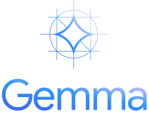
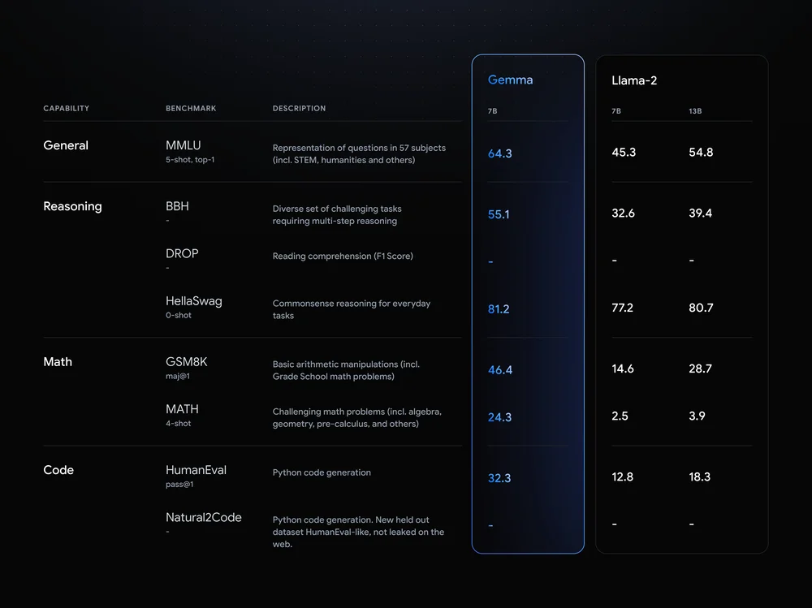

<p align="center" width="100%">
  </a>
</p>

## Gemma中文社区

### Gemma中文社区介绍
Gemma中文社区 Github: https://github.com/GemmaLab/GemmaChinese (大家点点star，共享PR)

在这里:
- 了解Gemma及Gemma中文最新信息
社区成员共同解读与Gemma相关的最新研究论文，深入理解前沿算法和大模型实践。

- 开放态度-协作共建
发展壮大国内开源大模型社区，推动AI技术实践，共享大模型相关经验、测试结果和应用落地。
  - 开展线上讲座
  - 项目展示
  - 学习资源
  - 主题活动
  - 成员间项目合作

- 鼓励大家踊跃贡献PR
https://github.com/GemmaLab/GemmaChinese
  - 【推理】
  - 【部署】
  - 【微调】
  - 【加速】
  - 【应用】

### 加入社区交流
加入微信交流群一起探索Gemma的应用！


## Google Gemma

Google在2024年2月21日发布了其开源Gemma模型。Gemma为纯decoder架构，是先进的轻量级开放模型系列，与Gemini模型采用相同的研究和技术。受到Gemini的启发，Google DeepMind和Google其他团队合作开发了Gemma，并用拉丁语中意为“宝石”的gemma为其命名。Gemma模型与Gemini共享技术和基础架构，在2B和7B同等规模模型中达到最优的效果。同时，Gemma可以直接在开发者的笔记本电脑或台式机上运行。

Gemma本次开源共四个模型，分别为：gemma-7b、gemma-7b-it、gemma-2b、gemma-2b-it，其中，it版本在基础版本上做了指令微调。

Gemma HuggingFace仓库：[Gemma](https://huggingface.co/collections/google/gemma-release-65d5efbccdbb8c4202ec078b)

</a>

## Gemma Prompt
Gemma的基础模型适用于文本续写任务，也可以用于进一步的微调。Gemma的Instruct模型采用以下对话输入格式：
```
<start_of_turn>user
knock knock<end_of_turn>
<start_of_turn>model
who is there<end_of_turn>
<start_of_turn>user
LaMDA<end_of_turn>
<start_of_turn>model
LaMDA who?<end_of_turn>
```

## Gemma 部署
部署gemma-7b-it需要18GB显存，3090或者4090即可满足条件。

```python

from transformers import AutoTokenizer, pipeline
import torch

model = "google/gemma-7b-it"

tokenizer = AutoTokenizer.from_pretrained(model)
pipeline = pipeline(
    "text-generation",
    model=model,
    model_kwargs={"torch_dtype": torch.bfloat16},
    device="cuda",
)

messages = [
        {"role": "user", "content": "Who are you? Please, answer in pirate-speak."},
]
prompt = pipeline.tokenizer.apply_chat_template(messages, tokenize=False, add_generation_prompt=True)
outputs = pipeline(
    prompt,
    max_new_tokens=256,
    add_special_tokens=True,
    do_sample=True,
    temperature=0.7,
    top_k=50,
    top_p=0.95
)
print(outputs[0]["generated_text"][len(prompt):])

```

如果采用4-bit模型，只需要9GB显存，加载方式如下：

```python
pipeline = pipeline(
    "text-generation",
    model=model,
    model_kwargs={
        "torch_dtype": torch.float16,
        "quantization_config": {"load_in_4bit": True}
    },
)

```

## Gemma 微调
微调Gemma模型可以采用HuggingFace的[TRL](https://github.com/huggingface/trl)库以及[QLoRA](https://arxiv.org/abs/2305.14314)，需要先配置以下环境：
```bash
pip install -U transformers
pip install git+https://github.com/huggingface/trl
git clone https://github.com/huggingface/trl
cd trl

```
然后运行以下脚本即可：
```bash
accelerate launch --config_file examples/accelerate_configs/multi_gpu.yaml --num_processes=1 \
    examples/scripts/sft.py \
    --model_name google/gemma-7b \
    --dataset_name OpenAssistant/oasst_top1_2023-08-25 \
    --batch_size 2 \
    --gradient_accumulation_steps 1 \
    --learning_rate 2e-4 \
    --save_steps 20_000 \
    --use_peft \
    --peft_lora_r 16 --peft_lora_alpha 32 \
    --target_modules q_proj k_proj v_proj o_proj \
    --load_in_4bit

```
在[OpenAssistant](https://huggingface.co/datasets/OpenAssistant/oasst_top1_2023-08-25)的对话数据集上微调完成，大约需要单张A10G显卡运行9小时。

